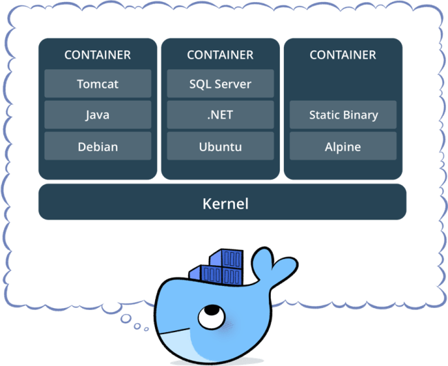

# Google Cloud Platform

https://console.cloud.google.com


### References

https://www.udemy.com/gcp-data-engineer-and-cloud-architect/

---

### Billing Considerations

* Delete projects, instances and free up resources when you don't need them anymore. Resources like BigTable and Cloud Spanner are pretty expensive.

---

# Google Cloud Shell

* [Google Cloud Platform tutorials](https://codelabs.developers.google.com/)
* [Cloud Shell starter guide](https://codelabs.developers.google.com/codelabs/cloud-shell/#0)
* [Documentation](https://cloud.google.com/sdk/gcloud)

The Google Cloud Shell enables a 5GB persistent disk storage Debian virtual machine configured with all the development tools needed for Google Cloud Platform. It runs on the Google Cloud, greatly enhancing network performance and authentication.

### Accounts

* Confirm account authentication: `gcloud auth list`
* Set active account: `gcloud config set account <ACCOUNT>`

### Projects

* List projects: `gcloud projects list`
* Show active project: `gcloud config list project`
* Set active project: `gcloud config set project <PROJECT_ID>`

### Help

* Simple guidelines for any command: `<COMMAND> -h`
* Detailed help: `<COMMAND> --help`

### Configuration

* Show environment configurations: `gcloud config list`
* Show all environment properties: `gcloud config list --all`

# Service Accounts

Service accounts allow the use of Google APIs.

#### Creating a Service Account

* IAM & admin -> Service accounts -> Create service account
* Fill in the form and download the key. This key is a `.json` file which contains the credentials.
* This file can be copied into a VM to allow it to use GCP services.
* Activate service account: `gcloud auth activate-service-account --key-file <CREDENTIALS FILE>`
* Reinitialize gcloud: `gcloud init`
* Select `Re-initialize this configuration with new settings`
* Choose the account to use and finish configuration

---

# Compute Options

# Contrasting GAE, GKE and GCE

### GAE
* Flexible, serverless platform for building highly available apps.
* Focus on writing code, and never want to touch a server, a cluster, or infrastructure.
* You neither know or care about the OS running your code.
* Useful for websites, mobile apps, gaming backends, RESTful APIs, IoT apps.

### GKE
* Logical infrastructure powered by Kubernetes.
* Increase velocity and improve operability dramatically by separating the app from the OS.
* You don't have dependencies on a specific OS.
* Useful for containerized workloads, cloud-native distributed systems and hybrid applications.


### GCE

* Virtual machines running in Google's global data center network.
* Complete control over your infrastructure and direct access to high-performance hardware such as GPUs and local SSDs.
* You need to make OS-level changes, such as providing your own network or graphic drivers, to squeeze out the last drop of performance.
* Useful for workloads requiring a specific OS or OS configuration, currently deployed on-premise software that you want to run in the cloud, or workloads that can't be easily containerized or require existing VM images.

---

# Google App Engine


* Platform-as-a-Service (PaaS), serverless and ops-free. Focus on the code, forget the rest.
* Google App Engine Environments come in two types: *Standard* and *Flexible*:
  * Standard: Pre-configured with Java 7, Python 2.7, Go and PHP. It is implemented as a container.
  * Flexible: Gives more choices such as Java 8, Python 3.x, .NET. It is implemented as a VM instance, allows specification of runtime and OS.
* Cloud Functions:
  * Serverless execution environment for building and connecting cloud services. Serverless refers to the ability to execute code but not store data. These functions should not be associated to any persistent-disk storage.
  * The idea is to write simple, single-purpose functions attached to events emitted from your cloud infrastructure and services.
  * The Cloud function is triggered when an event being watched is fired.
  * Code executes in a fully-managed environment.
  * You don't need to provision any infrastructure or worry about managing servers.
  * Cloud functions are written in JavaScript and run in any standard Node.js runtime.
  
#### Case Study: Running an App Engine App

1. Configure compute zone: `gcloud config set compute/zone us-central1-a`
2. Configure compute region: `gcloud config set compute/region us-central1`
3. Create a directory with your App code: `mkdir myapp`
4. Inside the directory, include your app code and an `app.yaml` file:

```
runtime: python27
api_version: 1
threadsafe: true

handlers:
- url: /.*
  script: my_first_app.app
```

5. Start the deployment instance of the application server: `dev_appserver.py ./`
6. Deploy to production: `gcloud app deploy app.yaml`. This code shows the URL in which the App is deployed.

---

# Google Compute Engine


* Infrastructure-as-a-Service (IaaS), fully controllable virtual machines down to OS.
* Virtual machines virtualize the hardware.
* **Preemptibility**: Preemptible instances are much cheaper, but can be terminated at any time if the resources are needed. This shutdown process starts with a soft-off signal and 30 seconds later a mechanical-off signal is sent and the VM terminated. Should only be used on fault-tolerant jobs and having a script to deal with the cleanup after the soft-off signal.
* **Automatic restart**: Allows machines to automatically restart in case it shuts down.
* **On host maintenance**: Allows machines to migrate to another VM instance in case maintenance is needed.
* Machines can be edited after being created, however you might need to shut it down first.
* Instances can be created through the command line.
* Accessing instances: `gcloud compute ssh <INSTANCE NAME> --zone <ZONE>`
* Creating a new disk: `gcloud compute disks create <DISK NAME> --size=<SIZE[100GB]> --zone <ZONE>`
* Associating the disk to an instance: `gcloud compute instances attach-disk <INSTANCE NAME> --disk <DISK NAME> --zone <ZONE>`. The disk must be created in the same zone as the instance.
* Show disks in an instance: `ls -l /dev/disk/by-id/`

---

# Google Container Engine 


* Clusters of machines running Kubernetes and hosting containers.
* A container image is a lightweight, stand-alone, executable package of a piece of software that includes everything needed to run it: code, runtime, system tools, system libraries and settings.
* Containers virtualize the operating system and are more portable than virtual machines. They are quicker and more lightweight.
* **Componentization**: software components are packed into independent containers and communicate through microservices.
* **Orchestration**: Google Cloud Platform manages containers through a Kubernetes cluster, similar to how a Hadoop cluster works.
* **Image Registration**: pull images from a container registry.
* **Flexibility**: mix-and-match with other cloud providers, on-premise.


* Pods are collections of containers that share the same underlying resources like IP address. The pod is managed by a Kubelet which is in turn controlled by the master node Kubernetes. The master node also runs the Kubernetes API Server, which services REST requests, schedules pod creation and deletion on worker nodes and synchronizes pod information.
* Container disks are volatile. When the container stops running, the data on the container disk is lost. For persistant disk storage you need to use gcePersistentDisk abstraction.
* Under the hood, GKE is simply a group of GCE instances running Kubernetes.
* Allows autoscaling.



#### Case Study: Running a Kubernetes Cluster

1. Configure compute zone: `gcloud config set compute/zone us-central1-a`
2. Configure compute region: `gcloud config set compute/region us-central1`
3. Create the cluster in the default project, zone and region specified on the configuration: `gcloud container clusters create my-cluster --num-nodes 1`
4. Since Kubernetes clusters are simply VM instances with specific configuration, they can be seen with `gcloud compute instances list`
5. Deploying a Docker file on the cluster (creates a pod): `kubectl run wordpress --image=tutum/wordpress --port=80`
6. Show active pods: `kubectl get pods`
7. By default, a pod is accesible to only other internal machines in the cluster. Let's expose it: `kubectl expose pod wordpress-2979532868-3s3w1 --name=wordpress --type=LoadBalancer`
8. Show services on the pod: `kubectl describe services wordpress`
9. The `LoadBalancer Ingress` is the address you can use to access the service.

---

# Storage Options

### Use Cases

|Use Case|Solution|
|---|---|
|Storage for compute|Persistent disks or SSDs|
|Media storage|Cloud Storage (Google's HDFS, not Hadoop)|
|SQL interface atop file data|BigQuery (Hive)|
|NoSQL document database|DataStore (MongoDB)|
|NoSQL fast scanning|BigTable (HBase)|
|OLTP|Cloud SQL (mySQL) or Cloud Spanner (Google's optimized SQL engine)|
|OLAP|BigQuery|
|Storage for compute with mobile SDKs|Cloud Storage for Firebase|
|Fast random access with mobile SDKs|Firebase Realtime DB|

---

# Block Storage (Persistent disks or SSDs)

* Data is not structured
* Lowest level of storage - no abstraction at all
* Meant to be used by VMs
* Location tied to the VM location
* Data is stored in volumes (called blocks)

---

# Cloud Storage


* Create buckets to store data
* Buckets are globally unique and have a name (unique), a location and a storage class
* Storage classes:
  * Multi-regional: frequent access from anywhere in the world - serving website content, streaming videos, gaming and mobile apps
  * Regional: frequent access from specific region - analytics operations
  * Nearline: accessed once a month at max - backup, disaster recovery and archival storage
  * Coldline: accessed once a year at max - data stored for legal or regulatory reasons
* Cloud Storage can be accesed through the XML and JSON APIs, command line (`gsutil`), GCP console or client SDK

#### Domain-Named Buckets

* Bucket names that contain dots are considered as domain names
* Bucket names must be syntactically valid DNS names
* Bucket names must end with a currently-recognized top-level domain, such as .com
* Domain ownership verification must be passed
  * Adding a special meta tag to the site's homepage
  * Uploading a special HTML file to the site
  * Verifying ownership directly from Search Console
  
Buckets can be shared publicly or to specific users, groups or domains, and can be assigned a Life Cycle Management Policy, usually referring to deletion after a certain period of time.

* Show life cycle management policy: `gsutil lifecycle get gs://<BUCKET NAME>`
* Set life cycle managament policy: `gsutil lifecycle set <JSON FILE> gs://<BUCKET NAME>`

#### Creating, listing and copying files from buckets

* Create a bucket: `gsutil mb -c <STORAGE CLASS> -l <REGION> gs://<BUCKET NAME>` ex: `gsutil mb -c regional -l asia-east1 gs://my-new-bucket`
* List buckets: `gsutil ls <BUCKET NAME>`
* Copy files from one bucket to another: `gsutil cp -r -p gs://bucket1/* gs://bucket2/` -r recursive, -p permissions

#### Saving data in a VM to a bucket

* Simply copy the file from the VM into the bucket: `gsutil cp <file> <bucket>`

#### Transfer Service

* A service to help get data **into** Cloud Storage from AWS, HTTP/HTTPS locations, local files or another bucket
* Allows for certain configurations:
  * Recurring transfers
  * Deletion from destination if non-existing in source
  * Deletion from source after copying over
  * Periodic synchronization of source and destination based on file filters
  
#### Versioning buckets

* Show versioning status: `gsutil versioning get gs://<BUCKET NAME>`
* Enable versioning: `gsutil versioning set on gs://<BUCKET NAME>`
* List versions of a file: `gsutil ls -a gs://<FILE PATH>`
* Recover a version: `gsutil cp <VERSION PATH> <RECOVERED FILE NAME>`

---

# Cloud SQL


* Used for relational databases, Cloud SQL supports MySQL and PostgreSQL
* ACID properties
* Too slow for OLAP
* Instances must be created explicitly, isn't serverless and a region must be specified.
* Access to first and second generation instances. Second generation instances:
  * Allow Cloud Proxy support, no need to whitelist IP addresses or configure SSL
  * Higher availability
  * Maintenance won't take down the sever

Connections made from Cloud Shell or a VM have dynamical ephemeral IP addresses, which MySQL whitelists temporarily. In the case of the VM you can make the IP address static.

The connection process is the following:

* Obtain a whitelisted IP address to connect from
* Access the Cloud SQL instance by defining host (Cloud SQL IP address), user and password
* The `gcloud beta sql connect <INSTANCE NAME> --user=<USER>` whitelists your IP address temporarily, and can be used in Google Shell, Compute Engine VMs or Google Cloud SDK. If using Google Cloud SDK you might prefer to add your public IPv4 address to the whitelisted addresses in the Google Cloud SQL instance, and then you could connect with `mysql --host=<CLOUD SQL IP> --user=<USER> --password=<PASSWORD>`

#### Creating a database from a .sql script

```gcloud beta sql connect <INSTANCE NAME> --user=<USER> < <.sql FILE>```

#### Loading data into Cloud SQL from Cloud Storage

* Whitelist your Cloud Shell IP address:
  * Go to the Cloud SQL instance details -> Connections
  * Select Add Network
  * Get the public IP address of the Cloud Shell instance, by typing: `wget -qO- ifconfig.me` 
  * Use the IP on the Add Network form
  * Get the Cloud SQL instance IP address
  * Select the import button to import data from a Bucket, the database and the table to load into
  * Check results by logging into the Cloud SQL instance: `mysql --host=<SQL IP> --user=<USER> --password=<PASSWORD>`
  
---

# Cloud Spanner


* Used for relational databases, Google's proprietary implementation. Is more advanced than Cloud SQL
* ACID properties
* Too slow for OLAP
* Offers horizontal scaling - bigger data, more instances, replication, autoscaling
* High availability
* Strong consistency
* Transactional reads and writes (especially writes)
* Sensitive to **hotspotting** - primary keys must be chosen carefully. Do not use monotonically increasing values, else writes will be on same locations. If keys must be monotonically increasing, you must has the primary key
* **Splits** can be created - ranges of rows that can be moved around independent of others and break up hotspots by distributing high read-write data
* Two **transaction modes**:
  * Locking read-write (slow)
  * Read only (fast)
* If making a one-off read, you can use a "Single Read Call". It is the fastest, no transaction checks needed.
* Allows **staleness**:
  * Can set timestamp bounds
  * Strong staleness - "read latest data"
  * Bounded staleness - "read version no later than..."
  * Exact staleness - "read at exactly..."
  
---

# DataStore


* Document-oriented data like HTML or XML
* Key-value structure
* Typically not used for OLTP or OLAP
* Used for fast lookup on keys
* Query execution time depends on size of returned result, not on size of the data set. Ideal for lookups of non-sequential keys
* Based on indices - fast to read, slow to write. Don't use for write-intensive data

#### RDBMS vs DataStore

|RDBMS|DataStore|
|---|---|
|Atomic transactions|Atomic transactions|
|Indices for fast lookup|Indices for fast lookup|
|Some queries use indices|All queries use indices|
|Query time depends on data set and result set sizes|Query time only depends on result set size|
|Structured relational data|Structured hierarchical data (XML, HTML)|
|Rows stored in tables|Entities of different kinds|
|Rows consist of fields|Entities consist of properties|
|Primary keys for unique IDs|Keys for unique IDs|
|Rows of table have same properties (strongly-enforced schema)|**Entities** (rows) of a **Kind** (table) can have different **Properties** (fields)|
|Types of all values in a column are the same|Types of different properties with same name in an entity can be different|
|Lots of joins|No joins|
|Filtering on subqueries|No filtering on subqueries|
|Multiple inequality conditions|Only one inequality filter per query|

#### Use DataStore when...

* Crazy scaling of read performance to virtually any size
* Hierarchical documents with key/value data

#### Avoid DataStore when...

* OLTP - use Google Cloud SQL or Spanner
* Non-hierarchical or unstructured data - use BigTable
* Analytics/BI/Warehousing - use BigQuery
* Immutable blocks - use Cloud Storage
* Lots of writes and updates on key columns

#### Full Indexing

* Built-in indices on each property (field) of each entity (row)
* Composite indices on multiple property values
* If you are certain a property will never be queried, can explicitly exclude it from indexing
* Each query is evaluated using its "perfect index" - the index that most optimally returns query results:
  * Equality filter
  * Inequality filter
  * Sort conditions
* Updates are really slow
* No joins
* Can't filter results based on subquery results
* Can't include more than one inequality filter

#### Multi-tenancy

* Separate data partitions for each client organization through namespaces in documents
* Can use same schema for all clients, but vary the value

#### Transaction support

* Can optionally use transactions - stronger than BigQuery or BigTable, weaker than Spanner (ACID++)

#### Consistency

* Two consistency levels possible for query results:
  * Strongly consistent: return up-to-date result, however long it takes
  * Eventually consistent: faster, but might return stale
  
---

# BigTable


* Similar to HBase, columnar database used for fast scanning of sequential key values
* Good for sparse data
* Data is sorted on the key value and then sequentially lexigraphically-similar values of the keys are stored adjacent to each other
* Sensitive to hot spotting - need to design key structure carefully. Sequentially increasing integer as key value kills the performance of BigTable

#### Properties of HBase

* Columnar storage
  * Data is represented with three columns: `key`, `column` and `value`
  * Efficient storage of sparse data - NULL values are not stored
  * Update attributes dynamically without changing storage structure - new columns are simply added as new rows
* Denormalized storage
  * Normalization avoids data redundancy, optimizing storage, which is great for RDBMS
  * In distributed systems, we have cheap storage and we must optimize number of disk seeks, therefore it is more efficient to have denormalized tables
  * This denormalization is made possible by complex data types, such as `ARRAYS`, `STRUCTS` or `MAPS`
* Only CRUD (Create/Read/Update/Delete) operations
  * Does not allow `JOIN`, `GROUP BY` and `ORDER BY` operations
  * Optimized for fast random reads on pre-prepared data
  * HBase doesn't perform comparisons between rows
  * No support for operations involving multiple tables
  * No support for indexes
  * No support for constraints
  * All details must be self-contained in one row
* ACID at the row level
  * Updates to a single row are atomic - all columns in a row are updated, or none are. Updates to multiple rows are not atomic, even if the update is on the same column in multiple rows
  
#### The 4D Data Model and Column Families

* Rows are represented with 4 elements:
  1. Row key - can be any data type, internally stored as a byte array, **sorted in ascending order**
  2. Column family - groups of columns, usually corresponding to the columns in a table in a RDBMS. Each column family is stored in a separate data file. These are set up at schema definition type
  3. Column - can be added at any time
  4. Timestamp - used as the version number for the values stored in a column. The value for any version can be accessed

#### RDBMS vs HBase

|RDBMS|HBase|
|---|---|
|Data arranged in rows and columns|Data arranged in a column-wise manner|
|Support SQL|NoSQL database - (key, value) store|
|Allows grouping, aggregates and joins|Only CRUD operations|
|Normalized to optimize storage|Denormalized to optimize disk seeks|
|ACID|ACID at the row level|

#### Use BigTable when...

* Very fast scanning and high throughput
* Non-structured key/value data
* Each data item is smaller than 10 MB
* Total data is larger than 1TB
* Time series data

#### Avoid BigTable when...

* OLTP - use Cloud SQL or Spanner
* Data is less than 1TB (can't parallelize efficiently)
* Analytics/BI/Warehousing - use BigQuery
* Documents or highly structured hierarchies - use DataStore
* Immutable blobs like movies - use Cloud Storage

#### Hotspotting

* Similar to Cloud Spanner, data is stored in a sorted lexicographical order of keys
* Data is distributed based on key values
* Poor performance when:
  * Read/writes are concentrated in some ranges
  * Sequential key values
* Salting: use hashing of key values
* Field promotion: use in reverse URL order like Java package names - similar prefixes, different endings
* BigTable will improve performance over time by observing read and write patterns and redistributing data so that shards are evenly hit
* BigTable will try to store roughly the same amount of data in different nodes

#### Schema design

* Each table has just one index - the row key. Choose it well
  * Use: reverse domain names, strings, keys with timestamp suffixes
  * Avoid: domain names, sequential numeric values, timestamps alone or as prefixes, mutable or repeatedly updated values
* Rows are sorted lexicographically
* Operations are atomic at row level
* Related entities are stored in adjacent rows thanks to column families
* Row keys should be smaller than 4KB per key
* Less than 100 column families per table
* Column values less than 10MB each
* Total row size less than 100MB

#### Reasons for poor perfomance

* Poor schema design (sequential keys)
* Small datasets
* Used for short times
* Cluster too small
* Cluster just fired up or scaled up
* HDD instead of SSD

---

# BigQuery


BigQuery is a fully-managed, serverless enterprise data warehouse for SQL-like queries on Google Storage data.

* Similar to Hive, in the form of an SQL-interface for non-relational data. However, the underlying implementation is different as BigQuery does not depend on HDFS or Hadoop
* Latency a bit higher than BigTable and DataStore
* No ACID (Atomicity, Consistency, Isolation, Durability) properties
* Great for OLAP
* Access through Web UI, REST API, clients and third-party

BigQuery has some public datasets available at: https://cloud.google.com/bigquery/public-data/

#### Data Model

* A Dataset is a collection of tables and views
* Each table must belong to a Dataset
* Each Dataset must belong to a Project
* Tables contains records with rows and columns
* Nested and repeated fields are allowed
* Table schema can be specified at creation time and during initial load. Schema can also be updated later
* Three types of tables:
  * Native tables: BigQuery storage
  * External tables: BigTable, Cloud Storage, Google Drive
  * Views
* Schema auto-detection is available when loading data or querying external data. BigQuery selects a random file in the data source and scans up to 100 rows of data to use as a representative sample, then examines each field and attempts to assign a data type to that field based on the values on the sample

#### Loading Data

* Batch loads
  * CSV
  * JSON
  * Avro
  * GCP DataStore backups
* Streaming loads
  * High-volume event tracking logs
  * Realtime dashboards
* Other alternatives
  * Public datasets
  * Shared datasets
  * Stackdriver log files
  
#### Interactive queries

* Executed as soon as possible
* Count towards limits on daily usage and concurrent usage

#### Batch queries

* Scheduled to run whenever possible
* Don't count towards limits on concurrent usage
* If not started within 24 hours, BigQuery makes them interactive

#### Views

* Logical queries
* Underlying query will execute each time the view is accessed
* Authorized views: share query results with groups without giving read access to underlying data
* Can give row-level permissions to different users within the same view
* Can't export data from a view
* Can't use JSON API to retrieve data from a view
* Can't mix standard and legacy SQL
* Can't use UDF on views
* No wildcard table references allowed
* Limit of 1000 authorized views per Dataset

#### Partitioned tables

* Table must be declared as partitioned at creation time
* Special table where data is automatically partitioned for you, based on date of loading
* Limit of 1000 tables per query does not apply

#### Reducing Dataset size when querying

* BigQuery's internal structure is columnar, therefore reducing the number of columns in a `SELECT` clause reduces the query size

#### Accesing BigQuery for the command line

* General help `bq help`
* Help on specific command `bq help <COMMAND>`
* List Datasets in project `bq ls`
* Configure project to work on `~/.bigqueryrc`
* Set project to current project id `echo project_id=$DEVSHELL_PROJECT_ID >> ~/.bigqueryrc`
* Show information of a table on a project `bq show <PROJECT_ID>:<DATASET>.<TABLE>`
* Show first few rows of a table `bq head -n <N_ROWS> <PROJECT_ID>:<DATASET>.<TABLE>`
* Load data from Cloud Storage into table (regular expressions for file path can be used, example: gs://my_folder/*.txt) `bq load --source_format=CSV <DATASET>.<TABLE> gs://<GOOGLE STORAGE FILE PATH> <SCHEMA(ex: name:string,gender:string,id:int)>`
* Query `bq query "<QUERY>"`
* Export a table to Cloud Storage `bq extract <TABLE> gs://<GOOGLE STORAGE FILE PATH>`
* Enable BigQuery shell `bq shell`
* Create Dataset (inside shell) `mk <DATASET>`
* Show information about a Dataset (inside shell) `show <DATASET>`

---

# DataFlow


DataFlow is an ETL tool used to transform data through a set of transformation operations in a computational directed acyclic graph. Syntactically similar to Apache Spark, and is based on Apache Beam.

Why is it modeled as a graph?
* Allows for internal optimization of computations
* Easy parallelization of parts of the graph

#### Pipeline

A Pipeline is a single, potentially repeatable job, from start to finish.

Encapsulates a series of computations that accepts some input data from external sources, transforms data, and produces output.

The actual computations run on a backend such as Apache Spark, abstracted in the **driver** by a **runner**. The driver defined the computational graph, while the runner executes the graph on a backend.

Supported backends include:
* Apache Spark
* Apache Flink
* Google Cloud DataFlow
* Beam Model

A typical Beam Driver Program has the following steps:

1. Create a Pipeline object.
2. Create an initial PCollection for pipeline data from either:
   * A source API to read data from an external source
   * In-memory data
3. Define the Pipeline transforms to change, filter, group or analyze PCollections.
4. Output the final, transformed PCollections through:
   * A sink API to write data to an external source
5. Run the pipeline using the designated Pipeline runner.

#### PCollections

PCollections are specialized container classes that can represent data sets of virtually unlimited size and allow for both batch (text files or BigQuery tables) and stream processing (Pub/Sub subscriptions).

Side inputs can be used to inject additional data into some PCollection in any node of the computational graph.

#### Transforms

Transforms take one or more PCollections as input, perform a processing function provided on the elements of the PCollection, and produce an output PCollection.

They use the 3W1H framework:

* **What** is being computed?


* **Where** in event time is the transform?


* **When** will the transform be executed?


* **How** do refinements relate?


#### Sources and Sinks

Sources and sinks are data storage formats, such as files in Cloud Storage or BigQuery tables.

---

# DataProc


DataProc is Google Cloud's managed version of Hadoop. Every machine in the cluster includes Hadoop, Hive, Pig and Spark.

#### Cluster Machine Types

* Built using Compute Engine VM instances
* Initialization actions can be run from GCP console, gcloud CLI, or programmatically, and scripts can be specified to be run from GitHub or Cloud Storage+
  * Use absolute -not relative- paths
  * Use shebang line to indicate script interpreter
* Scaling options:
  * Add workers
  * Remove workers
  * Add HDFS storage
  
---

# Pub/Sub


---

# DataLab


---

# Cloud ML


---
